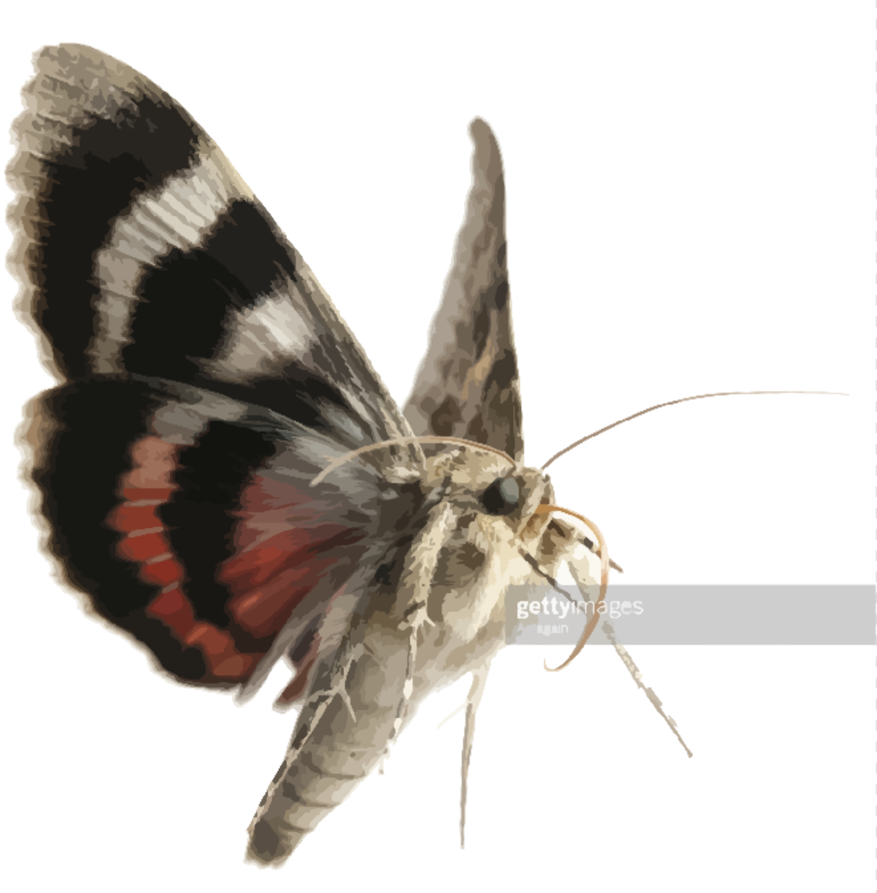

# MothSVG


<!-- tbd.
- license from Getty's Images
- show as SVG 
 -->


MothSVG allows creation of interactive SVG applications, with a programming model that adds logic to the graphics objects themselves. 

This programming model dates back decades, to Asymetrix Toolbook (1990’s), Adobe Flash, HyperCard (1987-)[^hc] and maybe beyond. While this model of merging vector graphics, events and cascading event handlers is well known, it has not really been available for pure Web applications.

<!-- tbd. Is the comment on Flash warranted, any Flash specialists reading this? -->

[^hc]: [Wasn't HyperCard cool?](https://www.youtube.com/watch?v=fFX1otbE_wU) (Youtube, Jun 2011, 53:18)

<br clear=left />

<!-- tbd. Some picture (SVG) showing the mental programming model; including groups, SVG and the browser environment -->


### Contributing

MothSVG is a work in progress (2019-). Check the Issues for things where you can contribute, or feel welcome to raise your own. Normal open source rules of conduct apply. Be nice and appreciate others!

Let's Go! 🏃‍♂️

---

## Requirements

- `npm`


## Kicking Tires

```
$ npm install
$ npm run build
```

This 

## Development


## Using the component

tbd.

<!-- from the 'component-template': https://github.com/sveltejs/component-template

## Consuming components

Your package.json has a `"svelte"` field pointing to `src/index.svelte`, which allows Svelte apps to import the source code directly, if they are using a bundler plugin like [rollup-plugin-svelte](https://github.com/rollup/rollup-plugin-svelte) or [svelte-loader](https://github.com/sveltejs/svelte-loader) (where [`resolve.mainFields`](https://webpack.js.org/configuration/resolve/#resolve-mainfields) in your webpack config includes `"svelte"`). **This is recommended.**

For everyone else, `npm run build` will bundle your component's source code into a plain JavaScript module (`index.mjs`) and a UMD script (`index.js`). This will happen automatically when you publish your component to npm, courtesy of the `prepublishOnly` hook in package.json.
-->


## References

- Based on [sveltejs/component-template](https://github.com/sveltejs/component-template)

